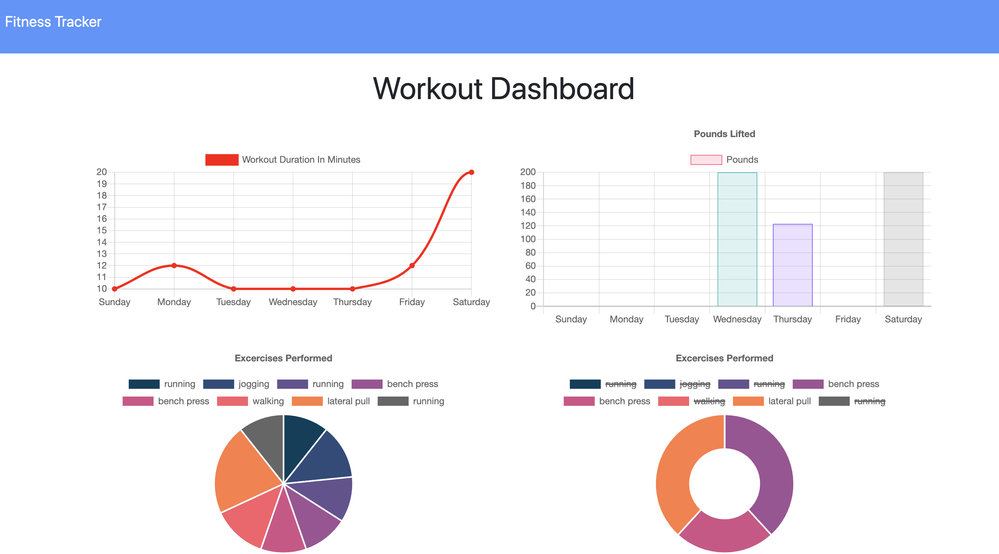

# Workout Tracker


This Workout tracker application allows the user to create and add workouts to a database and track these workouts in a dashboard. The user can also go in and continue old workouts and achieve their fitness goals. 

 generate a Stats page. 

## Technologies Used

* [Express.js](https://expressjs.com/)
* [Node.js](https://nodejs.org/en/)
* [Mongoose.js](https://mongoosejs.com/)
* [MongoDB](https://www.mongodb.com/)
* [Chart.js](https://www.chartjs.org/)


## Table of Contents

1. [Description](#Description)
2. [Installation](#Installation)
3. [Usage](#Usage)
4. [License](#License)


## Description

App allows for the user to track workouts. User has the capability to add either cardio or resistance training to a mongo database. The user input is stored by day. 


## Installation

* Clone the repository to your local device.
* Install the necessary npm packages by typing in the following command in the terminal:
```
npm install
```

## Usage

* This app is simple to run and is set up to use port 8000 for local running. Start the program in terminal with the code below:

```
node server.js 
```

* Another way to run this App is to, Navigate to [Heroku site](https://frozen-scrubland-57003.herokuapp.com/) and get started to use this Application.

## License

[MIT](public/assets/license.txt) license

## Screenshots



